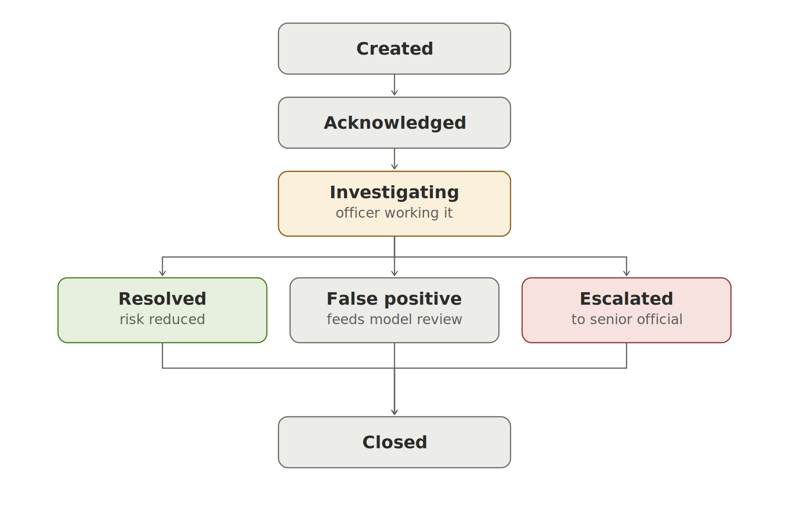
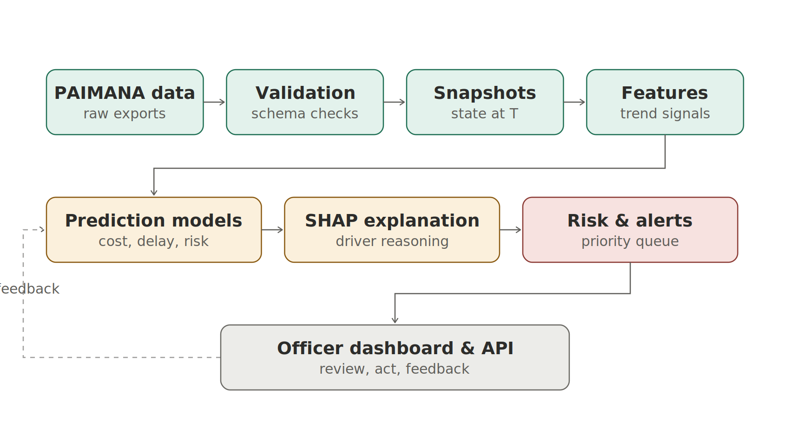
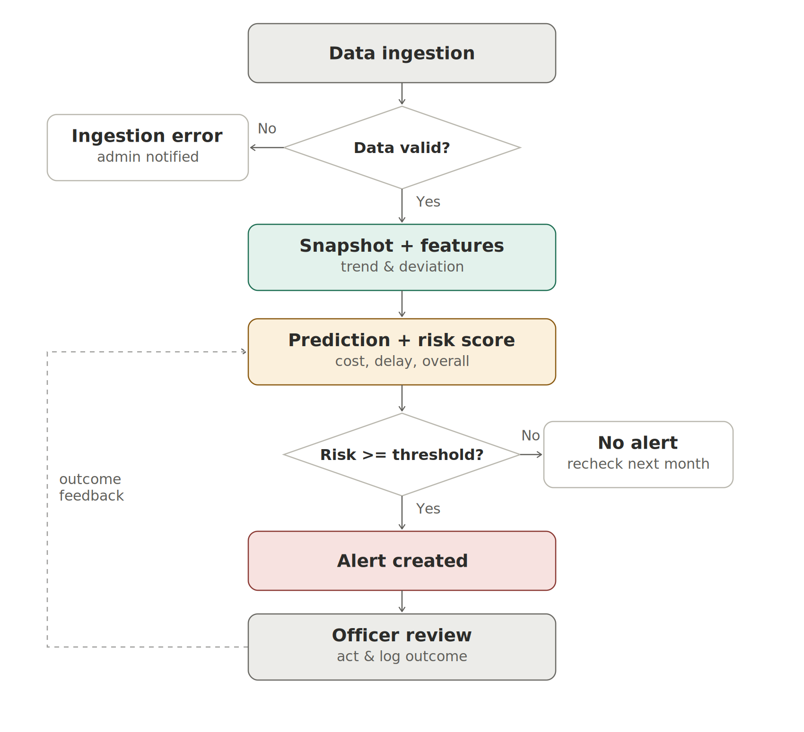
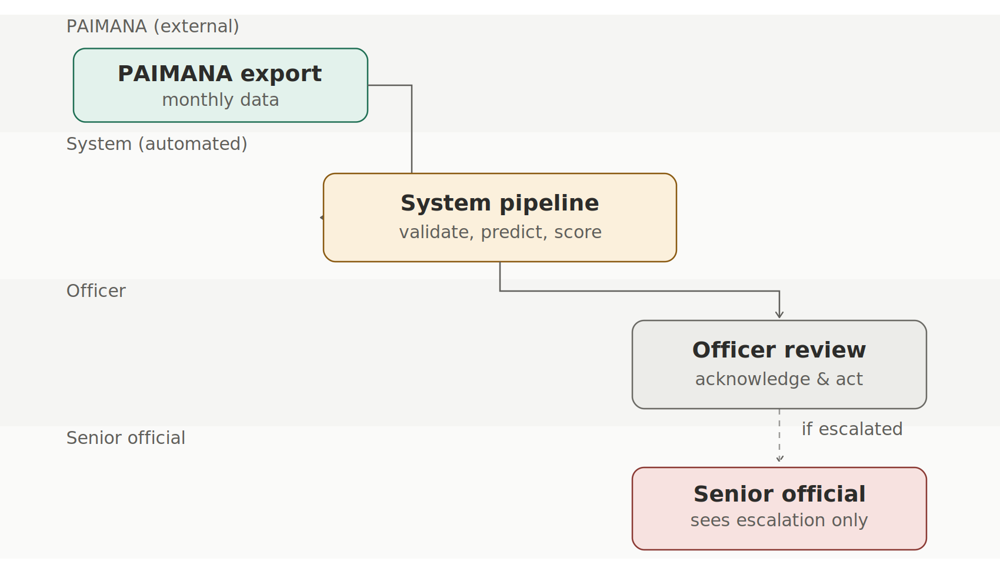
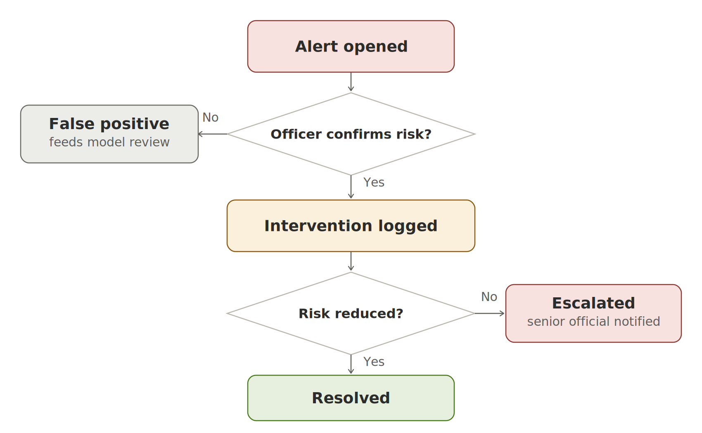
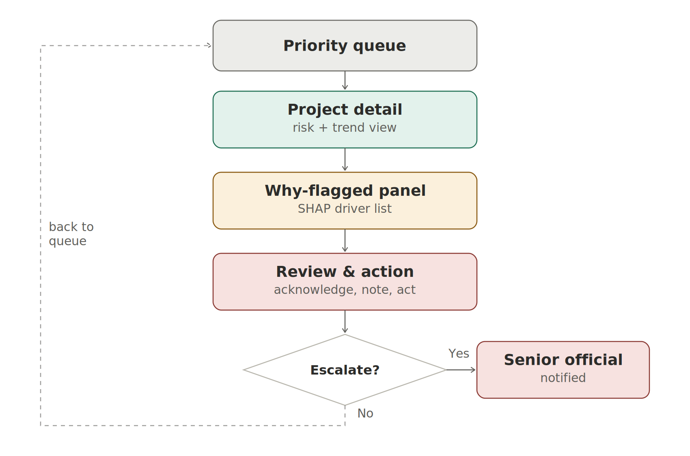

\newpage

# HOW TO USE THIS DOCUMENT

This document has two parts, matching how you said you're building this: train on Google Colab, integrate via Antigravity / Claude Code.

**Part A — ML Model Development Guide.** A complete, ordered notebook you can run in Google Colab: from loading your downloaded PAIMANA dataset through cleaning, target definition, feature engineering, a mandatory statistical baseline, model training, temporal validation, SHAP explainability, and exporting the artifacts (`cost_model.pkl`, `delay_model.pkl`, `feature_columns.json`, `model_run_metrics.json`) your backend will load.

**Part B — System, Workflow & UI Blueprint.** The full architecture document from earlier in this build: every module, workflow, decision point, screen, and the complete UI/UX design system, with every diagram generated so far embedded as an image at the point it's discussed. This part is carried over unchanged, as requested.

\newpage

# PART A — ML MODEL DEVELOPMENT GUIDE

## Workflow context for this guide

You will train the models on **Google Colab**, export the trained artifacts, and wire them into the prototype backend built with **Antigravity / Claude Code**. This guide is written for exactly that split: everything here runs standalone in a Colab notebook and ends with a small set of exported files (`.pkl` models, a `feature_columns.json`, and a metrics report) that your backend simply loads and calls — it does not assume any particular backend framework.

### Column-name disclaimer

The exact column names in your downloaded PAIMANA export may differ slightly from the names used below. The code is written so that **you only need to edit the `COLUMN_MAP` dictionary in Step 1** to match your real file — every later step refers to columns through that map, not by hardcoded names. This is deliberate: guessing your exact column names in advance is a good way to hand you code that silently fails.

---

## Step 1 — Load and inspect the data

```python
# --- Cell 1: setup ---
!pip install -q xgboost shap scikit-learn pandas

import pandas as pd
import numpy as np

# Upload your downloaded PAIMANA export (CSV or XLSX) in the Colab file browser first
df = pd.read_csv("paimana_export.csv")   # or pd.read_excel(...) if XLSX

print(df.shape)
print(df.columns.tolist())
df.head()
```

```python
# --- Cell 2: map YOUR real column names here — edit this to match your file ---
COLUMN_MAP = {
    "project_id":     "Project Code",
    "project_name":   "Project Name",
    "sector":         "Sector",
    "ministry":       "Line Ministry",
    "original_cost":  "Original Cost",
    "revised_cost":   "Revised Cost",
    "expenditure":    "Expenditure",
    "original_date":  "Original End Date",
    "revised_date":   "Revised End Date",
    "report_month":   "Reporting Month",   # if your export has a month/date column per row
}

df = df.rename(columns={v: k for k, v in COLUMN_MAP.items()})
df.info()
df.isna().sum().sort_values(ascending=False)
```

**What to check here manually before continuing:**
- Does the file have **one row per project per month** (a real snapshot history), or **one row per project** (a single current state)? This single fact decides whether you can do genuine temporal prediction (Option A) or need the honest-prototype route (Option B) — see the decision this guide builds toward in Step 6.
- How many unique projects and how many unique reporting months do you actually have?

```python
print("Unique projects:", df["project_id"].nunique())
if "report_month" in df.columns:
    print("Unique months:", df["report_month"].nunique())
    print(df.groupby("project_id")["report_month"].nunique().describe())
```

---

## Step 2 — Clean and standardise

```python
# --- Cell 3: basic cleaning ---
for col in ["original_cost", "revised_cost", "expenditure"]:
    df[col] = pd.to_numeric(df[col], errors="coerce")

for col in ["original_date", "revised_date"]:
    df[col] = pd.to_datetime(df[col], errors="coerce", dayfirst=True)

if "report_month" in df.columns:
    df["report_month"] = pd.to_datetime(df["report_month"], errors="coerce")

# Drop rows with no cost data at all — can't build a target without it
df = df.dropna(subset=["original_cost"])

# Data-quality flag — feed this in as a feature later, don't just discard rows silently
df["data_quality_flag"] = df[["revised_cost", "expenditure", "revised_date"]].isna().sum(axis=1)

df.describe(include="all").T
```

---

## Step 3 — Define the prediction targets

This is the single most important step in the whole notebook. Write these definitions down verbatim for your report and demo script — a judge will ask for exactly this.

```python
# --- Cell 4: target definitions ---

# Cost overrun target: did revised cost exceed original cost by more than 10%?
df["cost_overrun_flag"] = (
    (df["revised_cost"] - df["original_cost"]) / df["original_cost"] > 0.10
).astype(int)

# Delay target: did the revised completion date slip more than 6 months
# past the original date?
df["delay_days"] = (df["revised_date"] - df["original_date"]).dt.days
df["delay_flag"] = (df["delay_days"] > 180).astype(int)

print(df["cost_overrun_flag"].value_counts(normalize=True))
print(df["delay_flag"].value_counts(normalize=True))
```

If your file is a **single current snapshot per project** (not a monthly time series), you cannot yet honestly build "predict at month T, reveal at T+delta" — see Step 6 (Option B) for what to build instead of faking this.

---

## Step 4 — Feature engineering

```python
# --- Cell 5: engineered features ---

df["expenditure_ratio"] = df["expenditure"] / df["original_cost"]
df["cost_growth_ratio"] = df["revised_cost"] / df["original_cost"]

# If you DO have monthly snapshots, compute trend features per project:
if "report_month" in df.columns:
    df = df.sort_values(["project_id", "report_month"])
    df["expenditure_ratio_prev"] = df.groupby("project_id")["expenditure_ratio"].shift(1)
    df["expenditure_ratio_trend"] = df["expenditure_ratio"] - df["expenditure_ratio_prev"]
    df["months_since_start"] = df.groupby("project_id").cumcount()

# One-hot encode categorical context
df = pd.get_dummies(df, columns=["sector", "ministry"], dummy_na=True)

feature_cols = [c for c in df.columns if c.startswith((
    "expenditure_ratio", "cost_growth_ratio", "months_since_start",
    "data_quality_flag", "sector_", "ministry_"
))]
print(len(feature_cols), "features:", feature_cols)
```

---

## Step 5 — Baseline model (build this before any ML — the PS explicitly asks you to justify ML over statistics)

```python
# --- Cell 6: statistical baseline ---
from sklearn.metrics import precision_recall_fscore_support, roc_auc_score

# Simple rule: flag if expenditure is running well ahead of a nominal expected pace
baseline_pred = (df["expenditure_ratio"] > 0.6).astype(int)

p, r, f1, _ = precision_recall_fscore_support(
    df["cost_overrun_flag"], baseline_pred, average="binary", zero_division=0
)
print(f"Baseline — precision: {p:.2f}  recall: {r:.2f}  F1: {f1:.2f}")
```

Keep this number. Every time you report your ML model's performance, report this baseline right next to it.

---

## Step 6 — Choose Option A or Option B based on what Step 1 told you

```python
# --- Cell 7: temporal split decision ---
HAS_MONTHLY_HISTORY = "report_month" in df.columns and df.groupby("project_id")["report_month"].nunique().median() >= 3

print("Sufficient monthly history for genuine temporal validation:", HAS_MONTHLY_HISTORY)
```

- **If `True` (Option A):** continue to Step 7 using a **time-based split** — train on snapshots before a cutoff month, test on snapshots after it. Never shuffle-split across time; a random k-fold here silently leaks the future into training and invalidates every metric you report.
- **If `False` (Option B):** you have a genuine single-snapshot dataset. Still build the full pipeline below using a standard train/test split (random, stratified by target), but **label every result in your demo and report as "demonstration methodology, not a validated early-warning claim"** — this is the honesty rule from your own blueprint document, and it is what protects you from the toughest judge question rather than exposing you to it.

---

## Step 7 — Train the models

```python
# --- Cell 8: train/test split ---
from sklearn.model_selection import train_test_split

X = df[feature_cols].fillna(0)
y_cost = df["cost_overrun_flag"]
y_delay = df["delay_flag"]

if HAS_MONTHLY_HISTORY:
    cutoff = df["report_month"].quantile(0.8)
    train_idx = df["report_month"] < cutoff
    X_train, X_test = X[train_idx], X[~train_idx]
    y_cost_train, y_cost_test = y_cost[train_idx], y_cost[~train_idx]
    y_delay_train, y_delay_test = y_delay[train_idx], y_delay[~train_idx]
else:
    X_train, X_test, y_cost_train, y_cost_test, y_delay_train, y_delay_test = train_test_split(
        X, y_cost, y_delay, test_size=0.2, random_state=42, stratify=y_cost
    )
```

```python
# --- Cell 9: train cost-risk and delay-risk models ---
from xgboost import XGBClassifier

cost_model = XGBClassifier(
    n_estimators=200, max_depth=4, learning_rate=0.05,
    eval_metric="logloss", random_state=42
)
cost_model.fit(X_train, y_cost_train)

delay_model = XGBClassifier(
    n_estimators=200, max_depth=4, learning_rate=0.05,
    eval_metric="logloss", random_state=42
)
delay_model.fit(X_train, y_delay_train)
```

---

## Step 8 — Validate honestly

```python
# --- Cell 10: evaluation ---
from sklearn.metrics import classification_report, roc_auc_score

for name, model, y_test in [("Cost", cost_model, y_cost_test), ("Delay", delay_model, y_delay_test)]:
    proba = model.predict_proba(X_test)[:, 1]
    pred = (proba > 0.5).astype(int)
    print(f"\n--- {name} model ---")
    print(classification_report(y_test, pred, zero_division=0))
    try:
        print("ROC-AUC:", round(roc_auc_score(y_test, proba), 3))
    except ValueError:
        print("ROC-AUC: undefined (only one class present in test set)")
```

```python
# --- Cell 11: calibration sanity check ---
import numpy as np
proba = cost_model.predict_proba(X_test)[:, 1]
bins = np.linspace(0, 1, 6)
for lo, hi in zip(bins[:-1], bins[1:]):
    mask = (proba >= lo) & (proba < hi)
    if mask.sum() > 0:
        print(f"Predicted {lo:.1f}-{hi:.1f}: actual overrun rate = {y_cost_test[mask].mean():.2f} (n={mask.sum()})")
```

---

## Step 9 — Explainability (SHAP)

```python
# --- Cell 12: SHAP driver extraction ---
import shap

explainer = shap.TreeExplainer(cost_model)
shap_values = explainer.shap_values(X_test)

def top_drivers(row_idx, n=3):
    contributions = shap_values[row_idx]
    order = np.argsort(-np.abs(contributions))[:n]
    return [(feature_cols[i], round(float(contributions[i]), 4)) for i in order]

# Example: explain the highest-risk project in the test set
top_risk_idx = np.argmax(cost_model.predict_proba(X_test)[:, 1])
print("Top drivers for highest-risk project:", top_drivers(top_risk_idx))
```

For your backend, precompute and store `top_drivers()` output for every project at scoring time — don't call SHAP live on every dashboard page load, it's too slow for an interactive UI.

---

## Step 10 — Combine into one calibrated risk score

```python
# --- Cell 13: combined risk score ---
def overall_risk(cost_proba, delay_proba, w_cost=0.5, w_delay=0.5):
    return round(float(w_cost * cost_proba + w_delay * delay_proba), 4)

df.loc[X_test.index, "cost_risk"] = cost_model.predict_proba(X_test)[:, 1]
df.loc[X_test.index, "delay_risk"] = delay_model.predict_proba(X_test)[:, 1]
df.loc[X_test.index, "overall_risk"] = df.loc[X_test.index].apply(
    lambda r: overall_risk(r["cost_risk"], r["delay_risk"]), axis=1
)

df.loc[X_test.index, ["project_id", "cost_risk", "delay_risk", "overall_risk"]].sort_values(
    "overall_risk", ascending=False
).head(10)
```

Document this weighted-average formula explicitly in your report — a documented formula a judge can question and evaluate is far more defensible than a hidden ensemble score.

---

## Step 11 — Export everything your backend needs

```python
# --- Cell 14: export artifacts ---
import joblib, json
from datetime import datetime

joblib.dump(cost_model, "cost_model.pkl")
joblib.dump(delay_model, "delay_model.pkl")

with open("feature_columns.json", "w") as f:
    json.dump(feature_cols, f)

metrics_report = {
    "model_version": datetime.now().strftime("%Y-%m-%d_%H%M"),
    "trained_on_rows": len(X_train),
    "tested_on_rows": len(X_test),
    "temporal_validation": bool(HAS_MONTHLY_HISTORY),
    "cost_model_auc": float(roc_auc_score(y_cost_test, cost_model.predict_proba(X_test)[:, 1])) if y_cost_test.nunique() > 1 else None,
    "delay_model_auc": float(roc_auc_score(y_delay_test, delay_model.predict_proba(X_test)[:, 1])) if y_delay_test.nunique() > 1 else None,
}
with open("model_run_metrics.json", "w") as f:
    json.dump(metrics_report, f, indent=2)

print("Exported: cost_model.pkl, delay_model.pkl, feature_columns.json, model_run_metrics.json")
```

Download these four files from Colab. This is exactly the artifact set your `predictions` and `model_runs` tables (defined in the system blueprint below) expect — `model_run_metrics.json` maps directly onto the Model Performance screen, and `feature_columns.json` is what your backend uses to build the feature vector consistently at inference time.

---

## Step 12 — What your backend (built via Antigravity / Claude Code) needs to do with these files

0. Place all four exported files, unchanged, into the `ml/artifacts/` folder in the repo — this is the single handoff point between this notebook and the backend. See "Section 29 — ML artifact to backend connection" in the Full Development Guide for the exact loading contract.
1. Load `cost_model.pkl` and `delay_model.pkl` with `joblib.load(...)` inside your FastAPI (or equivalent) service.
2. On each new snapshot, build the feature vector using **exactly** the column order in `feature_columns.json` — mismatched order silently produces garbage predictions with tree models.
3. Call `.predict_proba()` for both models, combine via the Step 10 formula, and write the result into your `predictions` table.
4. Run the SHAP driver extraction (Step 9) once per scoring batch, not per page view, and store the top-3 drivers alongside the prediction.
5. Surface `model_run_metrics.json`'s contents directly on the Model Performance screen defined in the blueprint — this is the fastest way to make that screen real instead of a mockup.

---

## Honest gap check for your ML pipeline specifically

- This guide gives you a complete, runnable pipeline — but it cannot tell you in advance whether your actual downloaded file has monthly history or a single snapshot. Run Step 1's inspection cell first and that answers it for you.
- Class imbalance is likely (cost/delay overruns are probably a minority of projects) — if `value_counts(normalize=True)` in Step 3 shows a very skewed split (e.g. under 10% positive), consider `scale_pos_weight` in `XGBClassifier` or class-weighted metrics, and say so explicitly in your report rather than letting a high accuracy number hide a model that just predicts "no risk" for everything.
-e 
\newpage

# PART B --- SYSTEM, WORKFLOW & UI BLUEPRINT

# PRAGATI-AI — PS26103 Master Prototype Blueprint
### Predictive Risk & Governance Analytics for Timely Infrastructure
SIH 2026 · Problem Statement 26103 · MoSPI / PAIMANA

> This document executes the Master Prototype Builder sequence (Phases A–H) against the PS26103 problem statement and the PRAGATI-AI concept deck already prepared. It is the single source of truth for architecture, workflow, UI, and implementation.

---

# 1. SYSTEM OVERVIEW

**Core objective:** Convert PAIMANA's descriptive project-monitoring data into a predictive and prescriptive decision-support layer — forecasting cost overrun, schedule delay, and implementation risk for each of the ~1,981 monitored infrastructure projects, explaining *why* a project is flagged, and ranking projects for intervention before problems materialise.

**What the system is NOT:** It is not a replacement for PAIMANA, not a data-entry system, and not a public citizen-facing portal. It is a decision-support layer sitting on top of existing monitoring data, used internally by monitoring stakeholders.

**Primary value loop:** Data → Prediction → Explanation → Prioritisation → Human intervention → Outcome feedback → (loop back into model evaluation).

---

# 2. USERS & ROLES

| Role | Type | Core need |
|---|---|---|
| **Monitoring Officer / Analyst** | Primary | Screen flagged projects, understand *why* flagged, act, log outcome |
| **Senior Official / Policymaker** | Secondary | Portfolio-level risk view, sector/ministry benchmarking, no case-level action |
| **System / Data Admin** | Secondary | Manage data ingestion runs, verify data provenance, manage model versions |
| **PAIMANA / MoSPI data pipeline** | External system (non-human actor) | Supplies monthly project data |
| **ML/Prediction Engine** | System actor (non-human) | Generates scores, drivers, alerts automatically |

**ASSUMPTION:** The problem statement does not name explicit roles beyond "policymakers, monitoring agencies, project administrators, implementing agencies." The three human roles above are a reasonable consolidation for a demonstrable prototype — labelled here as an assumption, not stated fact.

**Permissions:**
- Officer: view all projects, acknowledge/action alerts, add review notes. Cannot edit source data or retrain models.
- Senior Official: view aggregated/portfolio dashboards only, read-only, no acknowledgment rights.
- Admin: trigger data ingestion, view data-quality logs, view model version history. Cannot alter predictions manually.

---

# 3. MODULES & FEATURES

1. **Data ingestion & validation** — pulls/accepts PAIMANA exports, checks schema and completeness
2. **Monthly snapshot timeline** — stores project state at each reporting month T
3. **Feature engineering** — derives trend/deviation signals from snapshots
4. **Prediction engine** — cost-risk model, delay-risk model, combined calibrated risk score
5. **Explainability (SHAP driver) engine** — attaches top drivers to every prediction
6. **Risk scoring & priority queue** — ranks projects by risk × exposure × urgency
7. **Early-warning alert engine** — creates alerts when risk crosses a threshold
8. **Officer review & intervention** — acknowledge, investigate, act, close the loop
9. **Outcome feedback capture** — records whether the alert was useful
10. **Portfolio / analytics dashboard** — national and sector-level aggregate views
11. **Model performance & validation module** — precision/recall, lead time, false-positive rate
12. **Data provenance module** — labels every screen with real/synthetic status, last sync
13. **Auth & role-based access** — login, role identification, permission gating
14. *(Optional)* **LLM project-intelligence assistant** — explains already-computed results, answers natural-language questions about a project; never generates the risk score itself

---

# 4. FEATURE DEPENDENCY MAP

**Data ingestion & validation**
- Purpose: bring monthly PAIMANA data into the system cleanly
- Triggered by: scheduled monthly job, or admin manual trigger
- Input: PAIMANA CSV/XLSX export
- Processing: schema check, completeness check, duplicate check
- Connected features: Snapshot timeline (consumes clean data), Data provenance module (logs the event)
- Output: validated dataset tagged with ingestion timestamp
- Who receives output: Snapshot timeline module
- What happens next: new snapshot row created per project
- Possible failure: malformed file, missing columns, partial upload
- Notification generated: admin alert on ingestion failure
- Data stored: `ingestion_log` table

**Monthly snapshot timeline**
- Purpose: reconstruct "what was known about project X at month T"
- Triggered by: successful ingestion
- Input: validated monthly dataset
- Processing: appends one row per project per month to `project_snapshots`
- Connected features: Feature engineering (consumes snapshot history)
- Output: time-indexed project history
- Who receives output: Feature engineering module
- Possible failure: missing prior month breaks trend calculation → flagged as "insufficient history," project excluded from prediction that cycle
- Data stored: `project_snapshots`

**Feature engineering**
- Purpose: turn raw snapshot fields into predictive signals (progress deviation, expenditure/cost ratio, milestone slippage, rolling trend)
- Triggered by: new snapshot committed
- Connected features: Prediction engine
- Output: feature vector per project per month
- Possible failure: insufficient historical depth → project marked "cold start," uses baseline rule instead of ML
- Data stored: `project_features`

**Prediction engine (cost / delay / risk models)**
- Purpose: forecast probability of cost overrun and schedule delay, produce one calibrated overall risk score
- Triggered by: new feature vector available
- Connected features: Explainability engine, Risk scoring & priority queue
- Output: `cost_risk`, `delay_risk`, `overall_risk`, model version
- Who receives output: Explainability engine, Priority queue, Dashboard
- Possible failure: model unavailable/service down → fallback to statistical baseline, flagged "baseline mode" on UI
- Data stored: `predictions`

**Explainability (SHAP) engine**
- Purpose: attach top 3–5 human-readable risk drivers to every prediction
- Triggered by: new prediction created
- Connected features: Priority queue, Officer review screen
- Output: ranked feature-importance list per prediction
- Data stored: `risk_drivers`

**Risk scoring & priority queue**
- Purpose: rank all currently-monitored projects by urgency
- Triggered by: prediction + driver data available
- Processing: risk score × cost exposure × urgency, per a documented formula
- Connected features: Early-warning alert engine, Dashboard
- Output: ranked queue
- Who receives output: Monitoring officer (primary consumer)

**Early-warning alert engine**
- Purpose: generate an actionable alert when a project crosses a risk threshold
- Triggered by: risk score exceeds threshold, or a driver value crosses a defined limit
- Connected features: Officer review & intervention
- Output: alert record (severity, type, created_at)
- Who receives output: Monitoring officer (in-app), optionally Senior Official for critical-severity alerts only
- Possible failure: alert storm (many projects cross threshold simultaneously) → deduplicated/grouped by sector, capped per officer per day
- Data stored: `alerts`

**Officer review & intervention**
- Purpose: human-in-the-loop investigation and action
- Triggered by: officer opens an alert or a project from the queue
- Input: officer's review note, action taken, acknowledgment
- Connected features: Outcome feedback capture
- Output: updated alert status (acknowledged / investigating / resolved / false positive)
- Data stored: `alerts.status`, `review_notes`

**Outcome feedback capture**
- Purpose: close the loop — was the warning actually useful?
- Triggered by: officer marks an alert resolved, or a scheduled outcome check after N months
- Connected features: Model performance module (feeds validation metrics)
- Output: labelled outcome record
- Data stored: `model_runs` / outcome table, used in the next model evaluation cycle

**Independent features:** Data provenance module, Auth/RBAC — these run continuously and don't sit in the linear chain.
**Sequential dependency chain:** Ingestion → Snapshot → Features → Prediction → Explanation → Priority queue → Alert → Review → Feedback.
**Parallel:** Dashboard/analytics and Model performance module both read from `predictions`/`alerts` independently and can render in parallel with the review workflow.

```
Data ingestion
     ↓
Monthly snapshot
     ↓
Feature engineering
     ↓
Prediction engine ── ↺ outcome feedback (from Officer review)
     ↓
SHAP explainability
     ↓
Risk scoring & priority queue
     ↓
Decision: risk ≥ threshold?
   ├── YES → Early-warning alert → Officer review → Action logged → Outcome feedback
   └── NO  → Project stays in normal monitoring, re-scored next cycle
```

---

# 5. COMPLETE END-TO-END WORKFLOW

```
SYSTEM STARTS (monthly ingestion job OR admin manual trigger)
        ↓
DATA VALIDATION (schema/completeness check)
        ↓
   Valid? ── NO → Ingestion failure log → Admin notified → Admin corrects/re-uploads
        │
       YES
        ↓
SNAPSHOT COMMITTED (state at month T stored)
        ↓
FEATURE ENGINEERING (per project)
        ↓
   Sufficient history? ── NO → Baseline rule used, project tagged "cold start"
        │
       YES
        ↓
ML PREDICTION (cost risk, delay risk, overall risk)
        ↓
SHAP EXPLANATION attached
        ↓
RISK SCORE + PRIORITY QUEUE updated
        ↓
   Risk ≥ threshold? ── NO → Project remains in normal monitoring list
        │
       YES
        ↓
ALERT CREATED
        ↓
OFFICER LOGS IN → sees alert in queue
        ↓
OFFICER OPENS PROJECT DETAIL → sees risk score + why-flagged drivers + trend
        ↓
OFFICER ACTS (acknowledge / investigate / escalate / mark false positive)
        ↓
STATUS UPDATED, REVIEW NOTE STORED
        ↓
   Escalation needed? ── YES → Senior Official notified for that project
        │
       NO
        ↓
OUTCOME TRACKED over following months
        ↓
OUTCOME FED BACK into model performance evaluation
        ↓
CYCLE REPEATS next monthly ingestion
```

---

# 6. ROLE-WISE WORKFLOW

**Monitoring Officer**
```
Login → Role: Officer identified → Priority queue (default landing screen)
   → Selects flagged project → Project detail + why-flagged screen
   → Reviews drivers and trend → Decides action
   → Acknowledge / Investigate / Escalate / Mark false positive
   → System updates alert status → Officer optionally adds note
   → Returns to queue (next project) OR views model-performance screen for context
```

**Senior Official / Policymaker**
```
Login → Role: Senior Official identified → Portfolio dashboard (default landing screen)
   → Views national/sector risk summary → Drills into a sector or ministry
   → Views benchmarking/comparative analytics
   → (Read-only — cannot acknowledge alerts)
   → Optionally views a specific project's summary (redirected read-only view of officer's project detail)
```

**System / Data Admin**
```
Login → Role: Admin identified → Data operations screen
   → Triggers/monitors monthly ingestion → Reviews validation log
   → Views data provenance status across the system
   → Views model version history and last retraining date
   → (Cannot alter individual predictions)
```

**Where workflows intersect:**
```
Officer marks alert "escalated (critical)"
     ↓
SYSTEM
     ↓
Senior Official receives escalation notification
     ↓
Senior Official views project summary
     ↓
SYSTEM records that the escalation was viewed
     ↓
Officer's alert thread shows "seen by senior official"
```

---

# 7. DATA FLOW

```
INPUT (PAIMANA monthly export)
   ↓
VALIDATION (schema, completeness, duplicate check)
   ↓
PROCESSING (feature engineering, ML inference, SHAP)
   ↓
DATABASE (projects, project_snapshots, project_features, predictions, risk_drivers)
   ↓
BUSINESS LOGIC (risk threshold rules, priority formula)
   ↓
OUTPUT (alerts, ranked queue, dashboard aggregates)
   ↓
NOTIFICATION / USER (officer sees alert; senior official sees escalation)
```

- **User-generated data:** officer review notes, acknowledgment/action status, outcome feedback tags
- **System-generated data:** predictions, risk drivers, priority ranking, alerts, model version metadata
- **External data:** PAIMANA monthly export (cost, expenditure, progress, dates, milestones)
- **Derived/processed data:** engineered features, calibrated risk scores, SHAP driver rankings

**Access:** Officers see full project detail for their assigned sector(s) *(ASSUMPTION: sector-based assignment — not stated in the PS, added because a national officer cannot realistically review 1,981 projects alone)*. Senior officials see aggregated views across all sectors. Admins see pipeline/data-health data, not project-level review notes.

---

# 8. DECISION LOGIC

**Decision 1 — Data validity**
- Condition: does the uploaded file match the expected schema and pass completeness checks?
- Who decides: system (automated validation)
- YES → snapshot committed → pipeline continues
- NO → ingestion log entry, admin notified, pipeline halts for that file only (other data unaffected)

**Decision 2 — Sufficient history for ML**
- Condition: does the project have enough monthly snapshots to compute trend features?
- YES → ML model used
- NO → statistical baseline used, project tagged "cold start / limited history"

**Decision 3 — Risk threshold crossed**
- Condition: overall_risk ≥ defined threshold (e.g. top-N percentile or fixed probability cut, to be tuned on real data)
- YES → alert created, enters officer's queue
- NO → project stays in normal monitoring, re-evaluated next month

**Decision 4 — Escalation**
- Condition: officer marks severity "critical" or risk remains high after N review cycles without resolution
- YES → senior official notified
- NO → stays within officer-level workflow

**Decision 5 — Alert outcome**
- Condition: did the predicted risk actually materialise, based on the next snapshot(s)?
- YES (materialised) → counted as true positive, strengthens model performance metric
- NO (didn't materialise) → counted as false positive, logged for calibration review

Edge cases handled: missing/incomplete monthly data for a project, duplicate project codes across sectors, unauthorized access attempt, prediction service unavailable (falls back to last successful run, flagged as "stale prediction"), officer cancels a review mid-way (state remains "investigating," resumable).

---

# 9. STATE TRANSITIONS




**Project risk state:**
```
Normal
  ↓ (risk crosses threshold)
Flagged
  ↓ (officer opens it)
Under review
  ├── Resolved (action taken, risk expected to reduce)
  ├── False positive (officer disagrees, feeds back to model)
  └── Escalated (senior official notified)
```

**Alert state:**
```
Created → Acknowledged → Investigating → (Resolved | False positive | Escalated) → Closed
```

- What causes each state: automated risk threshold (Created), officer opening it (Acknowledged), officer marking active work (Investigating), officer's final action (Resolved/False positive/Escalated), auto-close after outcome window (Closed).
- Who can change state: only the assigned Officer (or system, for auto-close).
- What becomes available: "Add note" and "Escalate" only appear once Acknowledged; "Mark outcome" only appears once Resolved.

---

# 10. SCREEN-TO-FEATURE MAPPING

| Screen | User | Purpose | Entry condition | User action | System action | Next screen | Data generated |
|---|---|---|---|---|---|---|---|
| Login | All | Authenticate, identify role | App opened | Enters credentials | Validates, assigns role | Role-specific dashboard | Session token |
| Priority queue | Officer | Triage flagged projects | Login as Officer | Selects a project | Loads project detail | Project detail | — |
| Project detail | Officer | Full risk view of one project | Selected from queue/search | Reviews trend, drivers | Renders prediction + SHAP | Why-flagged / Review action | — |
| Why-flagged panel | Officer | Understand drivers | Opened from project detail | Reads driver list | — | Back to project detail | — |
| Review & action | Officer | Acknowledge/act on alert | Opened from project detail | Selects action, adds note | Updates alert status | Priority queue (next item) | `review_notes`, status change |
| Portfolio dashboard | Senior official | National/sector risk overview | Login as Senior Official | Filters by sector/ministry | Aggregates and renders | Sector detail (read-only) | — |
| Model performance | Officer, Senior Official | Trust/validation evidence | Nav selection | Views metrics | Renders precision/recall/lead-time | — | — |
| Data provenance | All | Transparency on data status | Nav selection or badge click | Views source/timestamp | Renders provenance log | — | — |
| Data operations | Admin | Manage ingestion | Login as Admin | Triggers/monitors ingestion | Runs validation pipeline | Ingestion log | `ingestion_log` |

**Screens are not isolated** — the chain below is the backbone of the whole prototype:
```
Priority queue
   ↓ officer selects project
Project detail (risk + trend)
   ↓ officer opens
Why-flagged panel (SHAP drivers)
   ↓ officer acts
Review & action screen
   ↓ backend updates alert status
Database update (alerts, review_notes)
   ↓
Priority queue re-renders (item removed/updated)
   ↓ (if escalated)
Notification → Senior official's dashboard shows new escalation
```

---

# 11. FEATURE INTERCONNECTION

```
Data ingestion
   ↓ produces validated monthly dataset
Snapshot timeline
   ↓ produces time-indexed project history
Feature engineering
   ↓ produces feature vectors
Prediction engine
   ↓ produces risk scores          ↓ used by
                              Dashboard/portfolio view
   ↓ produces risk scores
SHAP explainability
   ↓ produces driver rankings
Priority queue
   ↓ produces ranked list          ↓ used by
                              Model performance module (for lead-time measurement)
   ↓ produces ranked list
Early-warning alert
   ↓ produces alert record
Officer review
   ↓ produces action + outcome
Outcome feedback
   ↓ used by → next Model performance evaluation cycle (feeds back into Prediction engine's validation, not a live retrain in the prototype)
```

If the Prediction engine fails: Priority queue falls back to the statistical baseline ranking; dashboard shows "baseline mode" badge; officer workflow continues unaffected functionally, just with lower-confidence data (visibly labelled).

---

# 12. TECHNICAL / BACKEND FLOW

```
Frontend (React + TypeScript)
   ↓
API layer (FastAPI, REST)
   ↓
Authentication (JWT/OAuth2 + RBAC)
   ↓
Backend services:
   - Ingestion/validation service
   - Feature engineering service
   - ML inference service (Scikit-learn / XGBoost / LightGBM)
   - Explainability service (SHAP)
   - Risk scoring & alert service
   ↓
Database (PostgreSQL): projects, project_snapshots, project_features, predictions, risk_drivers, alerts, review_notes, model_runs
   ↓
Response → Frontend update → (in-app) notification badge on queue/dashboard
```

Scheduled jobs (Celery/RQ) handle monthly ingestion and re-scoring. MLflow tracks model/dataset versions so every prediction can cite exactly which model produced it — this is what powers the data-provenance and model-performance screens.

**Technology not explicitly confirmed by the user for a fixed final stack** — the above matches the stack already chosen in the PRAGATI-AI deck (React/TypeScript, FastAPI, PostgreSQL, Scikit-learn/XGBoost, SHAP, MLflow, Celery, JWT/OAuth2, Docker/Nginx). Treated here as **CONFIRMED FROM INPUT**, not invented.

---

# 13. EXCEPTION & FAILURE FLOW

```
Ingestion
 ↓
File valid? ── NO → Error logged → Admin notified → Admin re-uploads/corrects → Retry ingestion
 ↓ YES

Prediction service
 ↓
Service reachable? ── NO → Fallback to last successful model run (flagged "stale") → Continue
 ↓ YES

Officer action
 ↓
Network/save fails? ── YES → Show inline error, retain officer's note in the form, allow retry without data loss
 ↓ NO → Save succeeds

Authentication
 ↓
Valid session? ── NO → Redirect to login, preserve intended destination for post-login redirect
 ↓ YES → Continue

Duplicate project code across a monthly export
 ↓
Flag as data-quality issue → Excluded from that cycle's predictions → Surfaced on Admin's data-operations screen, not silently dropped
```

---

# 14. DIAGRAM 1 — HIGH-LEVEL SYSTEM WORKFLOW







*(Rendered as an interactive diagram above in this conversation: PAIMANA data → Validation → Snapshots → Features → Prediction models → SHAP explanation → Risk & alerts → Officer dashboard, with an outcome-feedback loop back to the models.)*

```
User (Officer)
   ↓
Login / Authentication
   ↓
Role identification
   ↓
Dashboard (Priority queue)
   ↓
Major modules: Prediction · Explainability · Alerts · Model performance
   ↓
Processing (ML inference, SHAP)
   ↓
Decision: risk ≥ threshold?
   ↓
Final outcome: Alert reviewed, action logged, outcome fed back
```

---

# 15. DIAGRAM 2 — SWIMLANE / ROLE-BASED WORKFLOW




| Lane | Step 1 | Step 2 | Step 3 | Step 4 | Step 5 |
|---|---|---|---|---|---|
| **PAIMANA (external)** | Publishes monthly export | | | | |
| **System (ingestion/ML)** | | Validates + snapshots data | Runs features → prediction → SHAP | Creates alert if risk ≥ threshold | Records outcome after N months |
| **Officer** | | | | Reviews alert, acts, adds note | Confirms/updates outcome |
| **Senior official** | | | | *(if escalated)* Receives notification | Views escalation resolution |
| **Database** | | Stores snapshot | Stores prediction + drivers | Stores alert + review | Stores outcome for validation |

This resembles a business-process handoff: data leaves PAIMANA → system does all automated work → officer is the human decision point → senior official only enters for critical cases → database persists state at every handoff.

---

# 16. DIAGRAM 3 — DETAILED DECISION FLOW




*(Included because the alert-and-escalation logic has genuinely branching conditions.)*

```
Prediction generated
   ↓
Risk ≥ threshold?
   ├── NO → Project stays in normal monitoring
   └── YES → Alert created
              ↓
           Officer reviews
              ↓
           Officer's assessment
              ├── Confirms risk real → Investigate/act → Log intervention
              │         ↓
              │      Risk reduced next cycle?
              │         ├── YES → Resolved
              │         └── NO  → Still elevated → Escalate to senior official
              └── Disagrees (false positive) → Mark false positive → Feeds back to model validation
```

---

# 17. COMPLETE USER JOURNEY

*As an Officer:* I log in and land directly on my priority queue — not a generic dashboard — because triage is my actual job. I see projects ranked by risk, not alphabetically. I open the top one and immediately see, in plain language, why it was flagged: expenditure is running ahead of physical progress, and the gap has widened for three consecutive months. I don't have to interpret a bare percentage — I see the trend and the specific driver. I decide this is a real issue, log an intervention note, and mark it "investigating." Next month, I come back, the system shows me whether the risk actually reduced, and if it did, I mark it resolved. If a project stays critical despite my intervention, I escalate it — the senior official sees it without me having to send a separate email.

---

# 18. COMPLETE SYSTEM JOURNEY

Every month, PAIMANA data lands, gets validated, and is stored as a new time-stamped snapshot per project. The system reconstructs each project's trajectory, engineers signals from that trajectory, and asks two questions per project: will this overrun on cost, and will this run late — producing a calibrated combined risk score with SHAP-based reasons attached. Projects above the risk threshold generate alerts that populate a ranked queue for the responsible officer. The officer's decision and outcome are recorded and become part of the evidence used to judge whether the system is actually useful — not just accurate on paper, but operationally trustworthy — closing the loop that separates "descriptive monitoring" from genuine "predictive and prescriptive decision support," which is exactly what PS26103 asks for.

---

# 19. ASSUMPTIONS

- Three human roles (Officer, Senior Official, Admin) — consolidated from the PS's broader stakeholder list (policymaker, monitoring agency, project administrator, implementing agency) for a demonstrable prototype.
- Officers are assigned by sector/ministry rather than reviewing all 1,981 projects individually.
- A fixed risk threshold and a documented priority formula (risk × exposure × urgency) — exact numeric thresholds are left as a tunable parameter, to be set once real historical data is available, per the master guide's own caution against inventing performance numbers.
- Escalation trigger (critical severity, or unresolved after N cycles) is a reasonable operational rule, not stated in the PS.
- LLM assistant is explicitly scoped as read-only explanation over already-computed results — matching the PRAGATI-AI deck's own "never the source of the risk score" constraint.

# 20. MISSING INFORMATION

- Exact historical data access level (Open / Registered / Restricted, per MoSPI's own FAQ) is not yet confirmed for your team — this gates whether Option A (genuine model) or Option B (honest prototype) is what gets demonstrated.
- No confirmed list of who counts as an "escalation recipient" per sector in a real deployment.
- No confirmed authentication provider (a real deployment would likely need SSO into an existing government identity system — out of scope for a hackathon prototype, worth stating explicitly to judges).

# 21. RECOMMENDED IMPROVEMENTS

- Add a lightweight "confidence" indicator next to every prediction (high/medium/low, based on how much history the project has) — cheap to build, and directly defends against the "cold start" edge case.
- Add a single toggle on the dashboard: "Show baseline vs ML" — turns your PS-mandated statistical-vs-ML comparison into a live, demoable feature instead of a static report.
- Log every officer decision with a timestamp, even "no action" — this is what eventually proves the system's real-world lead time, your strongest Grand Finale evidence.

---

# 22. UI / UX DESIGN SYSTEM

**Product visual identity:** Institutional-analytical, not consumer-SaaS. The product exists to make a monitoring officer trust a number enough to act on it — every design decision should reduce doubt, not add delight for its own sake. Reject default blue-gradient "AI dashboard" styling entirely; it actively undermines credibility with a government evaluation panel that has seen dozens of templated entries.

**Design language — "control-room calm":** flat surfaces, hairline borders, no shadows, no gradients (one narrow exception below), restrained motion. Borrow from instrument panels and financial terminals rather than marketing sites: density and legibility over decoration.

**Color rationale (not decorative — every hue is functional):**
- Base surface: warm off-white `#F7F7F5`, cards in pure white, hairline borders in warm gray `#D9D7CE` — avoids the cold blue-gray that reads as generic AI template.
- Institutional accent (navigation, primary actions, headers): deep navy `#0C447C` → `#042C53` range — signals a government-grade tool without resorting to bright SaaS blue.
- Risk semantics — used **only** for risk state, nowhere else in the UI, so the meaning never dilutes: green `#3B6D11` (low), amber `#854F0B` (watch), red `#791F1F`/`#A32D2D` (critical).
- Provenance accent: a single distinct teal `#0F6E56`, used only for "live data" / "demo data" / "last synced" badges — visually unmistakable from risk colors.
- Text: near-black `#2C2C2A` primary, warm gray `#5F5E5A` secondary — never pure black, which feels colder and more generic.

**Typography:** one sans-serif family (Inter or IBM Plex Sans), two weights only — regular and medium. Numerals set in tabular figures wherever costs/percentages are compared in a column, so digits align vertically — a small detail that reads as "built by people who understand financial data."

**Spacing system:** 4px base unit; 8/12/16/24/32px steps. Cards: 20–24px internal padding, 12px radius, 1px hairline border, no shadow. Dense data tables use 8–12px row padding to maximize scanability for officers triaging many projects.

**Layout principles:** persistent left rail for primary navigation (Priority queue · Portfolio · Model performance · Data provenance · Data operations, the last only visible to Admin). Top bar shows last-sync timestamp and portfolio-wide risk summary at a glance — always visible, because "is this data current" is the first thing a skeptical evaluator checks.

**Component principles:** risk badges always pair color with a text label ("High"/"Medium"/"Low") — never color alone, both for accessibility and because it survives a projector screen or grayscale printout during judging. Buttons: solid navy for primary actions, outlined/ghost for secondary — no more than one solid button per view, to keep the primary action for that screen obvious.

**Interaction principles:** hover states are a 1px border-strong shift, not a shadow. Newly created alerts get a single, subtle non-looping pulse on the badge — draws the eye once, doesn't distract during review. Panel transitions (queue → detail) are a 180ms slide/fade, nothing longer — officers are working through volume, animation should never slow them down.

**Responsive strategy:**
- Desktop (primary demo surface): three-pane layout — nav rail, queue/list, detail panel — all visible at once.
- Tablet: nav rail collapses to icons-only; detail panel becomes a full-width overlay triggered from the list.
- Mobile: single-column stack — queue list only, tapping a project pushes to a dedicated detail screen; portfolio dashboard reflows charts to stacked full-width cards, not shrunk side-by-side.

**Accessibility:** WCAG-AA contrast on all text/background pairs; every interactive element keyboard-reachable with a visible focus ring (2px navy outline); risk never conveyed by color alone (see badges above); all charts have a text-equivalent summary line beneath them.

---

# 23. SCREEN-BY-SCREEN UI SPEC (states)

| Screen | Empty state | Loading state | Error state | Success state |
|---|---|---|---|---|
| Priority queue | "No flagged projects this cycle" with next scheduled ingestion date | Skeleton rows (flat gray blocks, no shimmer/gradient) | "Couldn't load queue — retry" with retry button | Ranked list renders with risk badges |
| Project detail | — (always has data once selected) | Skeleton for trend chart + driver list | "Prediction unavailable — showing last known state" (stale-data fallback) | Full trend + SHAP drivers rendered |
| Review & action | Empty note field with placeholder guidance | Save-in-progress spinner on button only, not full-screen | Inline error under the field, note text preserved | Confirmation toast, returns to queue |
| Portfolio dashboard | "Awaiting first monthly sync" on a fresh deployment | Skeleton chart cards | Partial-render: show whichever aggregates loaded, flag the ones that didn't | Full sector/ministry breakdown |
| Data operations (Admin) | "No ingestion runs yet" | Progress indicator during active ingestion | Detailed validation error log, row-level if possible | Green confirmation with row/project counts ingested |

---

# 24. SCREEN → SYSTEM LOGIC MAPPING (Phase E)




```
Priority queue screen
   → Officer clicks a project row
      → Feature: Project detail retrieval
         → System processing: fetch prediction + SHAP + snapshot trend
            → Data operation: read predictions, risk_drivers, project_snapshots
               → State: project marked "viewed" (not yet acted on)
                  → Next screen: Project detail

Project detail screen
   → Officer clicks "Acknowledge & act"
      → Feature: Officer review & intervention
         → System processing: validate note, update alert status
            → Data operation: write review_notes, update alerts.status
               → Decision: escalation flag set? 
                  ├── YES → Senior official notified
                  └── NO → stays with officer
               → Next screen: back to Priority queue, item updated/removed
```

---

# 25. SELF-CRITIQUE (Phase G)

**As an SIH judge:** the biggest risk is still data — if the demo can't show a real freeze-at-T / reveal-outcome-after-T sequence, the "predictive" claim is unproven no matter how good the UI looks. Fix: build the demo-data time-freeze feature *before* polishing any visual detail.

**As a product designer:** the risk badge + navy palette is safe but could still read as "generic government dashboard" if executed with default component shapes. Fix: commit to the tabular-numerals + hairline-border details above consistently — they're what actually differentiate it, not the color choice alone.

**As a senior frontend engineer:** three-pane desktop layout with a tablet/mobile collapse is achievable in the timeframe; don't add anything requiring a custom charting library beyond Recharts/ECharts — keep the component surface small and reusable (one `RiskBadge`, one `TrendChart`, one `DriverList` component reused across every screen that needs them).

**As an end user (officer):** the biggest usability risk is decision fatigue if the queue shows all 1,981 projects at once. Fix: default view should be "needs my action" only, with an explicit filter to expand to the full monitored set — this was implicit in the spec but should be made a first-class default, not an assumption buried in code.

---

# 26. FINAL VALIDATION CHECKLIST

- [x] Every major feature (ingestion → prediction → explanation → alert → review → feedback) has a workflow above.
- [x] Every important workflow has a corresponding screen (Section 10).
- [x] Roles have distinct, documented permissions (Section 2).
- [x] Every major decision has an explicit YES/NO path (Section 8, Diagram 3).
- [x] Data movement is traced end-to-end (Section 7).
- [x] State transitions are consistent between the written flow and the diagrams (Sections 9, 14–16).
- [x] No undocumented functionality was silently invented — deviations are labelled ASSUMPTION (Section 19).
- [x] UI system is distinctive and functionally justified, not decorative (Section 22).
- [x] Desktop/tablet/mobile behavior is intentional, not just shrinking (Section 22).
- [x] Primary demo journey (Officer: login → queue → detail → why-flagged → act → outcome) works end-to-end across every layer of this document.

# 27. REPOSITORY / FOLDER STRUCTURE

This is the structure a coding agent (or your team) should scaffold the project into. It maps directly onto the modules already defined in Sections 3–4 and 12 — nothing here introduces new functionality, it just gives the existing design a concrete home so different build sessions don't invent different layouts.

```
pragati-ai/
├── docs/
│   ├── PRAGATI-AI_Full_Development_Guide.md
│   └── images/
│       ├── 01_pipeline_architecture.png
│       ├── 02_end_to_end_workflow.png
│       ├── 03_alert_state_machine.png
│       ├── 04_officer_decision_tree.png
│       ├── 05_role_swimlane.png
│       └── 06_screen_to_feature_flow.png
│
├── ml/
│   ├── notebook/                  # the Colab notebook / exported .py version of Part A
│   └── artifacts/                 # OUTPUT of Colab training — see Section 29
│       ├── cost_model.pkl
│       ├── delay_model.pkl
│       ├── feature_columns.json
│       └── model_run_metrics.json
│
├── backend/
│   ├── app/
│   │   ├── routers/                # one file per endpoint group — see Section 28
│   │   │   ├── auth.py
│   │   │   ├── projects.py
│   │   │   ├── alerts.py
│   │   │   ├── dashboard.py
│   │   │   ├── model_performance.py
│   │   │   ├── data_provenance.py
│   │   │   └── admin.py
│   │   ├── services/                # one file per module from Section 3
│   │   │   ├── ingestion.py
│   │   │   ├── feature_engineering.py
│   │   │   ├── prediction.py
│   │   │   ├── explainability.py
│   │   │   ├── risk_scoring.py
│   │   │   └── alerting.py
│   │   ├── models/                  # DB models matching the tables in Section 11 (technical/backend flow)
│   │   │   ├── project.py
│   │   │   ├── snapshot.py
│   │   │   ├── prediction.py
│   │   │   ├── alert.py
│   │   │   └── model_run.py
│   │   └── main.py
│   └── requirements.txt
│
├── frontend/
│   ├── src/
│   │   ├── screens/                 # one per row of Section 10's screen table
│   │   │   ├── Login.tsx
│   │   │   ├── PriorityQueue.tsx
│   │   │   ├── ProjectDetail.tsx
│   │   │   ├── WhyFlaggedPanel.tsx
│   │   │   ├── ReviewAction.tsx
│   │   │   ├── PortfolioDashboard.tsx
│   │   │   ├── ModelPerformance.tsx
│   │   │   ├── DataProvenance.tsx
│   │   │   └── DataOperations.tsx
│   │   ├── components/              # reusable pieces named in Section 25's self-critique
│   │   │   ├── RiskBadge.tsx
│   │   │   ├── TrendChart.tsx
│   │   │   └── DriverList.tsx
│   │   └── theme/                   # design tokens from Section 22
│   │       └── tokens.ts
│   └── package.json
│
└── README.md
```

**Why each top-level folder exists, in one line:**
- `docs/` — this guide and its diagrams, so any future contributor (human or agent) can read the source of truth without hunting for it.
- `ml/` — kept fully separate from `backend/` on purpose. Training happens in Colab, independently of the app; the only thing that crosses the boundary is the `artifacts/` folder (Section 29).
- `backend/routers` vs `backend/services` — routers handle HTTP concerns only (auth, request parsing); services contain the actual module logic from Section 3–4, so the same service code is testable without spinning up the API.
- `frontend/screens` vs `frontend/components` — screens map 1:1 to Section 10's table; components are the shared pieces so `RiskBadge`, `TrendChart`, and `DriverList` are built once and reused everywhere they appear, per Section 25.

---

# 28. API CONTRACT

This is the concrete contract implied by the screen-to-feature mapping (Section 10) and the screen-to-system-logic mapping (Section 24). Backend and frontend work built from this table will actually fit together, whether they're built in the same session or separate ones.

| Method & path | Called from screen | Purpose | Request | Response (key fields) |
|---|---|---|---|---|
| `POST /auth/login` | Login | Authenticate, assign role | `{ username, password }` | `{ token, role }` |
| `GET /projects` | Priority queue | Ranked list, default filter = "needs my action" | query: `status`, `sector`, `min_risk` | `[{ project_id, name, sector, overall_risk, alert_status }]` |
| `GET /projects/{project_id}` | Project detail | Full risk view + trend | — | `{ project_id, name, cost_risk, delay_risk, overall_risk, model_version, trend: [{month, expenditure_ratio, progress}] }` |
| `GET /projects/{project_id}/drivers` | Why-flagged panel | Top SHAP drivers | — | `{ project_id, drivers: [{ feature, impact, direction }] }` |
| `POST /alerts/{alert_id}/review` | Review & action | Officer acts on an alert | `{ action: "acknowledge"\|"investigate"\|"resolve"\|"false_positive"\|"escalate", note }` | `{ alert_id, status, updated_at }` |
| `GET /alerts` | Priority queue, Dashboard | List/filter alerts | query: `status`, `severity`, `sector` | `[{ alert_id, project_id, severity, status, created_at }]` |
| `GET /dashboard/portfolio` | Portfolio dashboard | National/sector aggregates | query: `sector`, `ministry` | `{ total_projects, high_risk_count, cost_risk_count, delay_risk_count, by_sector: [...] }` |
| `GET /model-performance` | Model performance screen | Validation evidence | — | contents of `model_run_metrics.json` (Section 29): precision, recall, F1, AUC, model_version, temporal_validation |
| `GET /data-provenance` | Data provenance screen, top-bar badge | Data freshness/status | — | `{ last_sync, source: "live"\|"demo", data_quality_flags }` |
| `POST /admin/ingest` | Data operations (Admin) | Trigger monthly ingestion | `{ file }` (upload) | `{ ingestion_id, status, rows_processed }` |
| `GET /admin/ingestion-log` | Data operations (Admin) | Ingestion history | — | `[{ ingestion_id, timestamp, status, error_detail }]` |

**Auth on every route except `/auth/login`:** `Authorization: Bearer <token>`, role-checked per Section 2's permission table — e.g. `/admin/*` rejects non-Admin tokens, `POST /alerts/{id}/review` rejects Senior Official tokens (read-only role).

---

# 29. ML ARTIFACT → BACKEND CONNECTION

This is the exact handoff between the Colab notebook (Part A of this guide) and the running backend, spelled out so it doesn't get improvised differently each time someone touches either side.

1. Train in Colab following Part A, Steps 1–11.
2. Download the four exported files: `cost_model.pkl`, `delay_model.pkl`, `feature_columns.json`, `model_run_metrics.json`.
3. Place all four, unchanged, into `ml/artifacts/` in the repo (see Section 27's tree) — this folder is the single handoff point, nothing else in the backend should read model files from anywhere else.
4. On startup, `backend/app/services/prediction.py` loads `cost_model.pkl` and `delay_model.pkl` from `ml/artifacts/`, and loads `feature_columns.json` to know the exact column order to build feature vectors in — mismatched order silently breaks predictions, so this file is the contract, not a convenience.
5. `backend/app/routers/model_performance.py` simply reads and returns `model_run_metrics.json` verbatim for the `GET /model-performance` route — no recomputation, so the number shown in the UI is always exactly what Colab produced.
6. If `ml/artifacts/` is empty (fresh clone, before you've trained anything), the backend should start in a clearly labeled "no model loaded" state rather than failing silently — the Data Provenance screen (Section 22–23) is exactly where this state is meant to surface, per the "empty state" row already defined there.
7. Re-training later just means repeating steps 1–3 and restarting the backend — there is intentionally no automatic retraining pipeline in this prototype scope.
